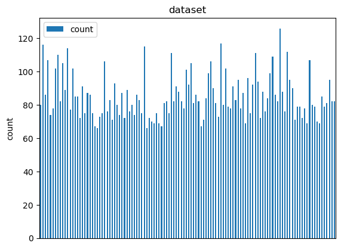
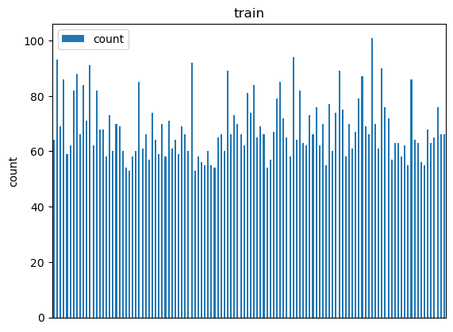
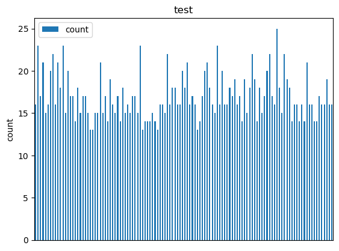

# 1. 클래스 별 폴더 만들기

모든 클래스가 하나의 폴더에 들어있고, **labels.csv**에 각 파일의 클래스 정보가 있다. 따라서 이를 이용하여 클래스 별 폴더로 나누겠다.

## 1.1. pandas를 사용하여 csv파일 읽기

```python
import pandas as pd
labels = pd.read_csv("./labels.csv")
```

## 1.2. 각 클래스 별 폴더 만들기

dataset 폴더를 만들고, 하위 폴더에 각 클래스를 저장하겠다.

```python
import os

os.makedirs("./dataset", exist_ok=True)

for class_name in labels['breed'].unique():
    os.makedirs("./dataset/"+class_name, exist_ok=True)  # exist_ok가 True이면 디렉토리가 이미 있는 경우는 넘어가고, 없으면 만든다.
```

## 1.3. 모든 이미지 파일은 jpg임을 확인

```python
for file_name in os.listdir("./train"):
    if file_name.split('.')[-1] != 'jpg':
        print(file_name)
```

## 1.4. labels.csv에 기반하여 파일을 폴더 별로 분류

```python
import shutil

for idx, row in labels.iterrows():
    file_name = row['id']
    class_name = row['breed']
    shutil.copy("./train/"+file_name+".jpg", "./dataset/"+class_name+'/'+file_name+".jpg")
```

## 1.5. 데이터 크리에이터 캠프에서 만든 draw_class_barplot 함수로 클래스 별 데이터 수 확인

```python
import matplotlib.pyplot as plt

def draw_class_barplot(
    path: str,
    title: str):
    
    dir_list = os.listdir(path)

    classLenLst = []
    for class_name in dir_list:
        classLenLst.append(len(os.listdir(path+class_name)))
        
    df_dict = dict()
    df_dict["name"] = dir_list
    df_dict["count"] = classLenLst

    df= pd.DataFrame(df_dict)

    plt.figure(figsize=(100,100))
    df.plot(kind="bar", x='name', y='count')
    plt.xlabel("class name")
    plt.ylabel("count")
    plt.title(title)
    ax = plt.gca()

    #hide x-axis
    ax.get_xaxis().set_visible(False)

    return df

df = draw_class_barplot("./dataset/", "dataset")
print(f"전체 데이터 수: {df['count'].sum(0)}")
```

전체 데이터 수: 10222


# 2. train, test 데이터 나누기

## 2.1. train_dataset, test_dataset 폴더 만들기

```python
os.makedirs("./train_dataset", exist_ok=True)
os.makedirs("./test_dataset", exist_ok=True)

for class_name in labels['breed'].unique():
    os.makedirs("./train_dataset/"+class_name, exist_ok=True)  # exist_ok가 True이면 디렉토리가 이미 있는 경우는 넘어가고, 없으면 만든다.
    os.makedirs("./test_dataset/"+class_name, exist_ok=True)
```

## 2.2. 데이터의 80%를 학습 20%를 test로 사용

각 클래스 별로 20%의 데이터를 test 데이터로 사용

```python
TRAIN_PCT = 0.8
```

```python
class_lst = os.listdir("./dataset")

for label_name in class_lst:
    file_lst = os.listdir("./dataset/"+label_name)
    for file_name in file_lst[:round(len(file_lst)*TRAIN_PCT)]:
        shutil.copy("./dataset/"+label_name+'/'+file_name, "./train_dataset/"+label_name+'/'+file_name)
        
    for file_name in file_lst[round(len(file_lst)*TRAIN_PCT):]:
        shutil.copy("./dataset/"+label_name+'/'+file_name, "./test_dataset/"+label_name+'/'+file_name)
```

## 2.3. 나눠진 데이터를 확인

```python
df = draw_class_barplot("./train_dataset/", "train")
print(f"전체 train 데이터 수: {df['count'].sum(0)}")
df = draw_class_barplot("./test_dataset/", "test")
print(f"전체 test 데이터 수: {df['count'].sum(0)}")
```

전체 train 데이터 수: 8185<br/>
전체 test 데이터 수: 2037




# 3. PyTorch 학습 코드 작성

## 3.1. 이미지 전처리 리스트 작성

torchvision의 transoform을 사용하여 전처리 리스트를 작성한다.

```python
import torchvision.transforms as transforms

transformer = transforms.Compose([
    transforms.Resize(224),
    transforms.CenterCrop(224),
    transforms.ToTensor(),  # ToTensor는 0 ~ 255로 이루어진 정수를 0 ~ 1의 실수로 바꿔준다.
    transforms.Normalize(mean=(0.485, 0.456, 0.406), std=(0.229, 0.224, 0.225))
])
```

## 3.2. ImageFolder 메소드를 사용하여 dataloader 생성

```python
# 파라미터 설정
BATCH_SIZE = 64
NUM_WORKERS = 0  # 이 값은 사용하는 쓰레드를 의미하므로 적절히 설정하자 (0는 main thread 사용을 의미한다)
```

```python
import torch
import torchvision

train_dataset = torchvision.datasets.ImageFolder(
    root="./train_dataset",
    transform=transformer)
train_dataloader = torch.utils.data.DataLoader(
    train_dataset,
    batch_size=BATCH_SIZE,
    shuffle=True,
    num_workers=NUM_WORKERS)
```

## 3.3. 모델 만들기

```python
# Pretrained model 불러오기
from torchvision.models import resnet50, ResNet50_Weights
import torch.nn as nn
import torch.nn.functional as F

model = resnet50(weights=ResNet50_Weights.IMAGENET1K_V2)  # Pretrained resnet18 불러오기

# Freeze All Layers
for p in model.parameters():
    p.requires_grad = False

num_features = model.fc.in_features  # Convolutional Layer로 얻어지는 feature 가져오기
model.fc = nn.Linear(num_features, 120)  # 120개의 클래스를 구분할 수 있도록 마지막 fully connected layer 수정하기

'''
class Model(nn.Module):
    def __init__(self):
        super().__init__()
        self.conv1 = nn.Conv2d(3, 6, 5)
        self.pool = nn.MaxPool2d(2, 2)
        self.conv2 = nn.Conv2d(6, 16, 5)
        self.fc1 = nn.Linear(16 * 5 * 5, 120)
        self.fc2 = nn.Linear(120, 84)
        self.fc3 = nn.Linear(84, 120)

    def forward(self, x):
        x = self.pool(F.relu(self.conv1(x)))
        x = self.pool(F.relu(self.conv2(x)))
        x = torch.flatten(x, 1)  # flatten all dimensions except batch
        x = F.relu(self.fc1(x))
        x = F.relu(self.fc2(x))
        x = self.fc3(x)
        return x
    
model = Model()
'''
```

## 3.4. loss function, optimizer 정의

```python
from torch import optim

learning_rate = 0.0001

criterion = nn.CrossEntropyLoss()
optimizer = optim.Adam(model.parameters(), lr=learning_rate)
```

## 3.5. 테스트 함수 작성

```python
# test_dataloader를 정의
test_dataset = torchvision.datasets.ImageFolder(
    root="./test_dataset",
    transform=transformer)
test_dataloader = torch.utils.data.DataLoader(
    test_dataset,
    batch_size=BATCH_SIZE,
    shuffle=True,
    num_workers=NUM_WORKERS)

# 테스트 함수
def test():
    model.eval()  # model을 evaluation 하기 위한 상태로 바꾼다.

    test_loss = 0
    total = 0
    correct = 0

    for data in test_dataloader:
        inputs = data[0]
        labels = data[1]

        outputs = model(inputs)
        outputs = F.softmax(outputs, dim=0)  # 확률 값으로 변경

        loss = criterion(outputs, labels)
        _, predicted = torch.max(outputs.data, 1)

        total += labels.size(0)
        correct += (predicted == labels).sum().item()
        
        test_loss += loss.item()

    test_loss = test_loss / len(test_dataloader)

    accuracy = 100 * correct // total

    print(f"test loss: {test_loss}")
    print(f"test accuracy: {accuracy}%")
```

## 3.5. 학습

```python
EPOCH = 2 
model.train()  # 모델을 학습하기 위한 상태로 변경

for epoch in range(EPOCH):
    train_loss = 0
    total = 0
    correct = 0
    
    for i, data in enumerate(train_dataloader):
        
        inputs = data[0]
        labels = data[1]
        
        optimizer.zero_grad()
        outputs = model(inputs)
        outputs = F.softmax(outputs, dim=0)  # 확률 값으로 변경
        loss = criterion(outputs, labels)
        loss.backward()
        optimizer.step()
        
        _, predicted = torch.max(outputs.data, 1)
        total += labels.size(0)
        correct += (predicted == labels).sum().item()
        
        train_loss += loss.item()
        
    train_loss = train_loss / len(train_dataloader)
    accuracy = 100 * correct // total
    
    print(f"train loss at epoch {epoch+1}: {train_loss}")
    print(f"train accuracy: {accuracy}%")
    
    test()
```

# 4. 제출

submission 파일을 만들어 kaggle에 올려본다.

## 4.1. 만들어진 모델로 Prediction DataFrame 만들기

```python
from PIL import Image

dict_lst = []

test_path = "./test/"
for file_name in os.listdir(test_path):
    img = Image.open(test_path + file_name)
    img = transformer(img).unsqueeze(0)
    pred = F.softmax(model(img)[0], dim=0).tolist()
    id_lst = [file_name.split('.')[0]]
    
    dict_lst.append(id_lst + pred)
    
pred_df = pd.DataFrame(dict_lst, columns =['id']+train_dataset.classes)
```

## 4.2. 제출할 파일 csv로 저장하기

```python
pred_df.to_csv("./submission.csv", index=False)  # index는 없이 csv파일을 만들기 위해
```
